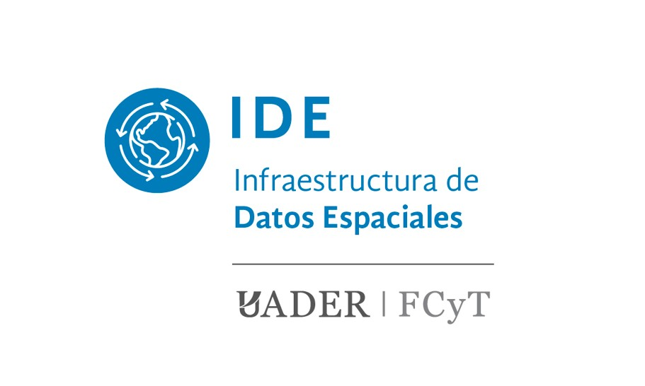

# Bienvenidos a la FCyT IDE

---

## Introducción

Una IDE *( Infraestructura de datos Espaciales )* es una asociación de información geoespacial que se encuentra disponible a través de Internet y se conforma por un conjunto de recursos (catálogos, servidores, aplicaciones, capas SIG, páginas web, etc.), cuyo principal objetivo es asegurar la colaboración y accesibilidad de la información geoespacial. 

## ¿Por qué una IDE?

La *Facultad de Ciencia y Tecnología* nuclea docentes, investigadores, estudiantes de grado y posgrado que utilizan y producen datos, información y productos georreferenciados, tal es el caso como en la toma de decisiones sobre problemas que afectan el territorio, planeamiento, producción, localización de establecimientos, infraestructuras y servicios, distribución de la poblacion, identificación de corredores biólogicos, ente otros.

Sin embargo, muchas veces esta información no se encuentra accesible para quienes desean consultarla, o no se encuentra sistematizada de forma que facilite su uso. Es por esto que la IDE viene a solventar este inconveniente, permitiendo el acceso ubicuo a dichos recursos. Posibilitando al usuario desarrollar ciertas tareas como la búsqueda, visualización, accesibilidad, análisis y descarga. 

Asimismo, la IDE de la Facultad se complementa con la Infraestructura de Datos Espaciales de la República Argentina <a href = "https://www.idera.gob.ar/" > (IDERA) </a>.

