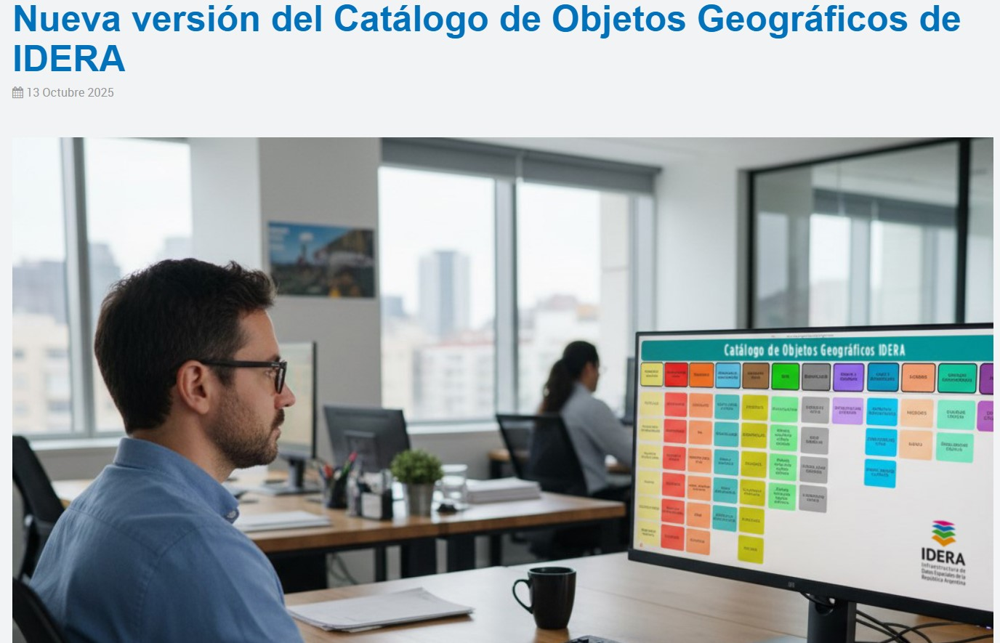
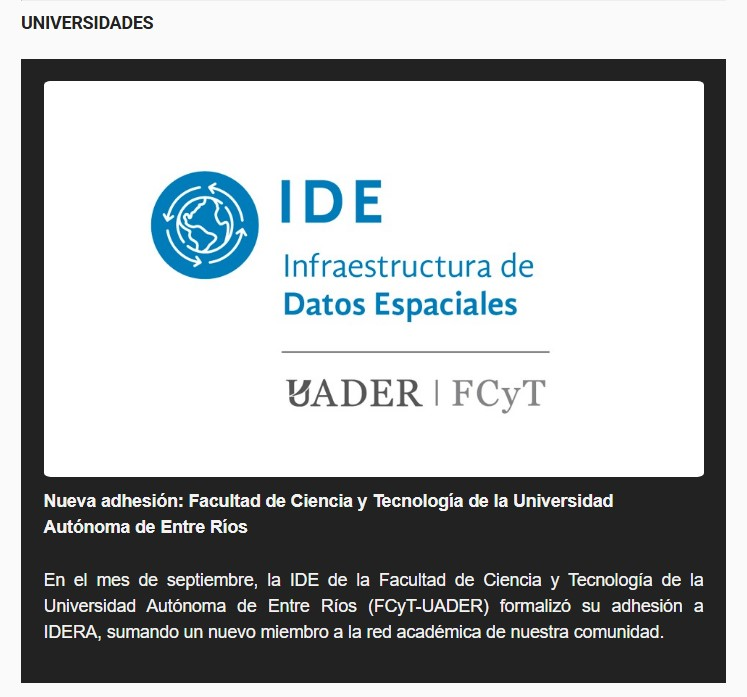

# IDE FCyT UADER

Portal académico para organizar, visualizar y compartir información geoespacial, proyectos, publicaciones y productos de transferencia vinculados al territorio.

[Explorar proyectos](pages/VulnerabilidadDeltadelParaná.md){ .md-button .md-button--primary }
[Abrir catálogo STAC](pages/catalogo.md){ .md-button .md-button--soft }

13

Proyectos territoriales destacados

1

Catálogo STAC institucional

3

Espacios de divulgación activa

24/7

Acceso abierto a contenidos

## Qué ofrece la IDE

Una IDE (Infraestructura de Datos Espaciales) integra catálogos, capas SIG, visores, metadatos y documentos técnicos para facilitar la consulta y reutilización de información geográfica.

En la FCyT, esta infraestructura articula docencia, investigación, extensión y gestión territorial, con foco en datos abiertos, trazabilidad y acceso público al conocimiento.

## Accesos rápidos

- ### Catálogo y estándares
  

  Navegá el catálogo STAC y revisá la guía de uso para comprender la estructura de datos publicada.

  [Abrir catálogo STAC](pages/catalogo.md){ .quick-link }
  [Ver guía de uso](pages/Indicaciones_de_uso.md){ .quick-link .quick-link--alt }

- ### Proyectos territoriales
  

  Consultá trabajos organizados por región y temática: Delta del Paraná, Espinal, humedales, gestión forestal y más.

  [Explorar](pages/VulnerabilidadDeltadelParaná.md){ .quick-link }
  [Ver línea humedales](pages/humedales.md){ .quick-link .quick-link--alt }

- ### Publicaciones y divulgación
  

  Accedé a resúmenes, materiales de congresos, experiencias de transferencia y novedades institucionales.

  [Ir a novedades](pages/novedades.md){ .quick-link }
  [Ver divulgación](pages/webRA.md){ .quick-link .quick-link--alt }

## Últimas novedades

- ### Adhesión de la IDE-FCyT a IDERA
  

  Incorporación de la IDE-FCyT a la red académica nacional, fortaleciendo interoperabilidad y colaboración federal.

  **Fecha:** 10 de octubre de 2025  
  [Leer nota](https://mailchi.mp/9cbd10081684/boletn-informativo-ideractiva-mes-10){ .quick-link }

- ### Nueva versión del COG de IDERA
  

  Actualización del catálogo de objetos geográficos con nuevas clases, subclases y mejoras para navegación semántica.

  **Fecha:** 13 de octubre de 2025  
  [Ver publicación](https://www.idera.gob.ar/index.php/publicaciones/noticias/nueva-version-del-catalogo-de-objetos-geograficos-de-idera){ .quick-link .quick-link--alt }

## Articulación institucional

La IDE FCyT se complementa con la Infraestructura de Datos Espaciales de la República Argentina (IDERA) y con iniciativas académicas de la región para fortalecer la interoperabilidad y la colaboración.

- [IDERA](https://www.idera.gob.ar/)
- [Repositorio IDE-FCyT en GitHub](https://github.com/IDE-FCyT/IDE-FCyT)
