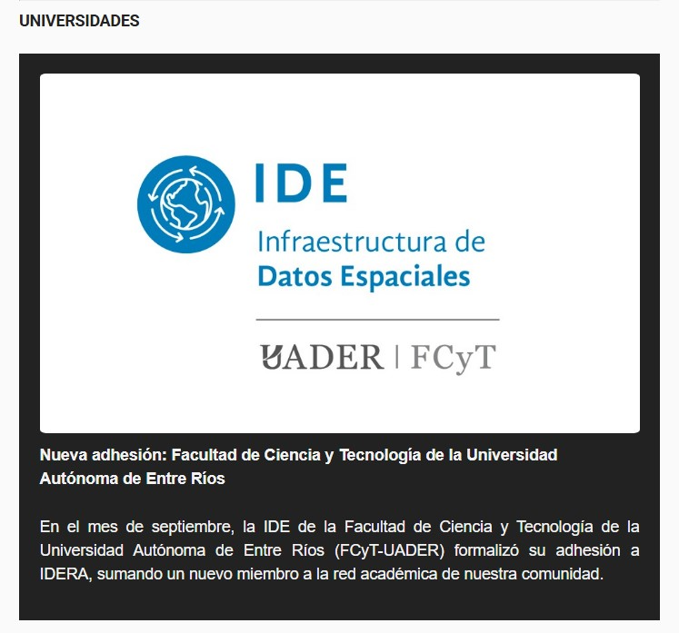
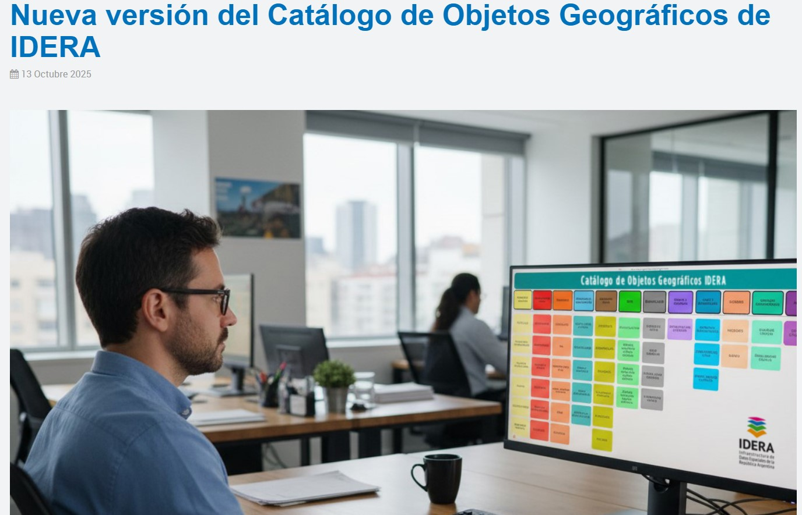

# IDE FCyT UADER

Explorá datos geoespaciales, investigaciones y experiencias de la Facultad de Ciencia y Tecnología de la UADER. Elegí por dónde empezar:

  

    VISITORS
    <strong data-visitor-count data-historical-base="2552">2,552</strong>
  

  
Cantidad de visitas recibidas

## ¿Qué querés hacer?

- ### Explorar datos

  Encontrá colecciones geoespaciales por temática y consultá sus mapas, metadatos y descargas.

  [Ir al catálogo](pages/catalog_index.md){ .quick-link }
  [Cómo usar los datos](pages/Indicaciones_de_uso.md){ .quick-link .quick-link--alt }

- ### Conocer investigaciones

  Recorré los proyectos de la facultad por región, línea temática o vínculo con el territorio.

  [Ver proyectos](pages/proyectos.md){ .quick-link }

- ### Ver producción y novedades

  Descubrí pósters, productos web, conversatorios y noticias de la IDE.

  [Explorar contenidos](pages/produccion_divulgacion.md){ .quick-link }

## Qué ofrece la IDE

Una IDE (Infraestructura de Datos Espaciales) reúne catálogos, capas SIG, visores y metadatos para facilitar la consulta y reutilización de información geográfica. En la FCyT articula docencia, investigación, extensión y gestión territorial.

## Novedades destacadas

- ### Adhesión de la IDE-FCyT a IDERA
  

  Incorporación de la IDE-FCyT a la red académica nacional, fortaleciendo interoperabilidad y colaboración federal.

  **Fecha:** 10 de octubre de 2025  
  [Leer nota](https://mailchi.mp/9cbd10081684/boletn-informativo-ideractiva-mes-10){ .quick-link }

- ### Nueva versión del COG de IDERA
  

  Actualización del catálogo de objetos geográficos con nuevas clases, subclases y mejoras para navegación semántica.

  **Fecha:** 13 de octubre de 2025  
  [Ver publicación](https://www.idera.gob.ar/index.php/publicaciones/noticias/nueva-version-del-catalogo-de-objetos-geograficos-de-idera){ .quick-link .quick-link--alt }

[Ver todas las novedades](pages/novedades.md)

## Articulación institucional

La IDE FCyT se complementa con la Infraestructura de Datos Espaciales de la República Argentina (IDERA) y con iniciativas académicas de la región para fortalecer la interoperabilidad y la colaboración.

- [IDERA](https://www.idera.gob.ar/)
- [Repositorio IDE-FCyT en GitHub](https://github.com/IDE-FCyT/IDE-FCyT)
