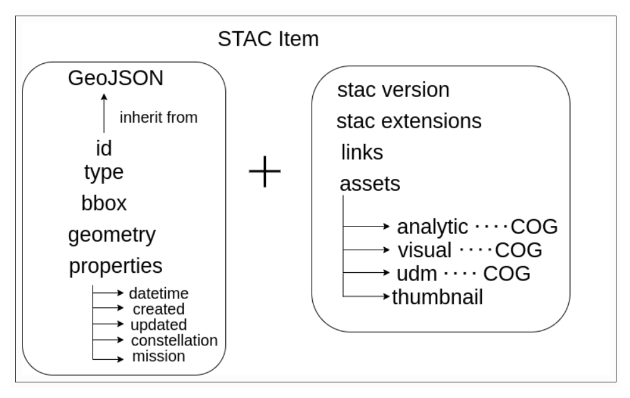
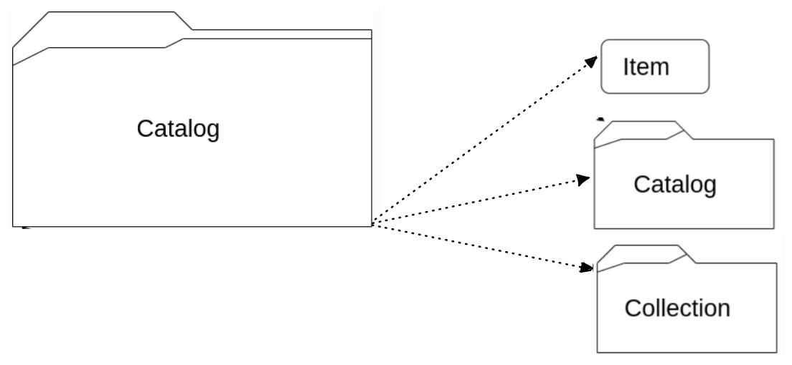
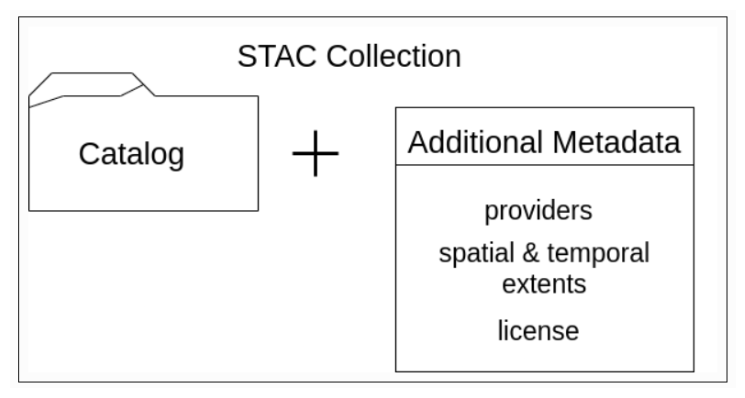

# Indicaciones de uso

La infraestructura de datos espaciales (IDE) esta creada bajo las especificaciones STAC (SpatioTemporal Asset Catalog). [Acceso al sitio oficial de STAC](https://stacspec.org/en/)

En esencia, las especificaciones STAC tienen como objetivo estandarizar la forma en que se estructuran, exponen y consultan los activos geoespaciales en línea. Un "**activo espaciotemporal**" es cualquier archivo que representa información sobre la Tierra en un lugar y momento determinado, su enfoque original se centraba en escenas de imágenes satelitales, pero las especificaciones hoy en día cubren una amplia variedad de usos, incluidas fuentes de aviones y drones, datos hiperespectrales, radar de apertura sintética (SAR), video, nube de puntos, lidar, modelos digitales de elevación (DEM), vectores, compuestos como NDVI, entre otros.
Poseer este estándar común elimina la necesidad de buscar a través de muchos proveedores de satélites el acceso a datos requeridos.
STAC es simple y extensible en su diseño, debido a que está conformado por cuatro componentes claves. Estos componentes se pueden usar de forma aislada entre sí, pero idealmente se recomienda su uso en conjunto. 
STAC se conforma a través de una red de archivos **JSON** (JavaScript Object Notation, "Notación de Objeto de JavaScript") que hacen referencia a otros archivos JSON, y cada JSON se adhiere a una especificación central concreta dependiendo del componente STAC que esté describiendo. Este formato JSON central también se puede personalizar para adaptarse a diferentes necesidades, lo que hace que la especificación STAC sea altamente flexible y adaptable.

## Componentes

### STAC item
Unidad atómica central o bloque de construcción fundamental, representa un solo activo espaciotemporal como un GeoJSON complementado con metadatos adicionales.  

### STAC catalogo
Especifica una estructura para vincular varios elementos STAC para rastrearlos o examinarlos. Es un archivo JSON simple y flexible de enlaces a items, catálogos o colecciones. De manera análoga se puede comparar como una carpeta en una estructura de archivos, contenedora de items, pero también puede contener catálogos o colecciones. 

### STAC coleccion
Se utiliza para describir un grupo de elementos relacionados. Son catálogos que agregan más metadatos necesarios y describen un grupo de elementos relacionados.  

### API STAC
Las API (interfaz de programación de aplicaciones del inglés application programming interface) STAC, es una especificación de API RESTful para consultar catálogos de forma dinámica. Está diseñada con un conjunto estándar de puntos finales (endpoint) para buscar catálogos, colecciones y elementos.

