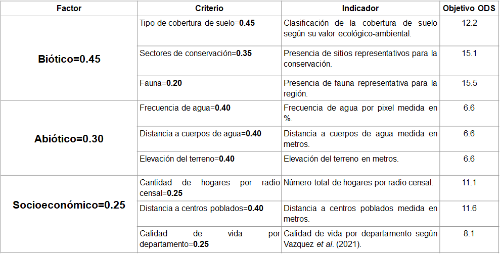
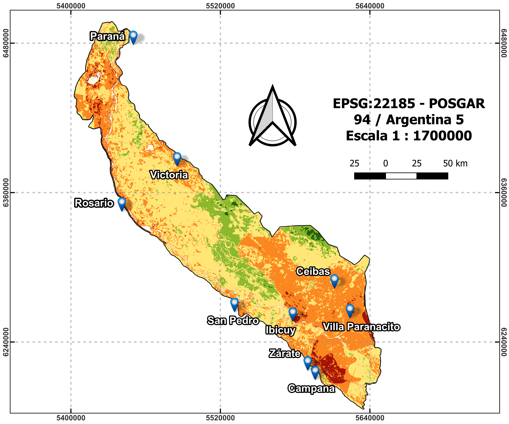

# 🌿 Aportes a la caracterización de la vulnerabilidad ambiental en el Delta del río Paraná, Argentina, mediante geoinformática y técnicas de evaluación multicriterio
---

**Autores:** Facundo Boladeras, Virginia Piani, Lisandra P. Zamboni, Walter Sione, Fernando Tentor y Pablo Aceñolaza  
**Institución:** FCyT - UADER  
**Ubicación geográfica:** Delta del río Paraná, Argentina  
**Año:** 2021

---

## 📝 Resumen

La región del Delta e Islas del Río Paraná, en Argentina, es utilizada por industrias como la silvícola y ganadera, generando problemáticas socioambientales en relación con el uso del territorio con fines económicos. Este trabajo analiza la vulnerabilidad ambiental del territorio utilizando herramientas geoinformáticas y técnicas de Evaluación Multicriterio (EMC), mediante la metodología de suma lineal ponderada.

Se abordó el problema desde tres dimensiones territoriales: factores bióticos (p=0,45), abióticos (p=0,35) y socioeconómicos (p=0,20), subdivididos en criterios asociados a indicadores de desarrollo sostenible (ODS). El resultado final fue un mapa que representa la vulnerabilidad ambiental en una escala de 1 a 3, donde los valores más altos indican mayor vulnerabilidad. Se encontró que el 85 % de los píxeles pertenecieron a categorías media y media-alta (49 % y 37 % respectivamente), y sólo un 3 % se clasificó como alta, destacándose en áreas como Zárate, Campana, Villa Paranacito e Ibicuy.

---

## 🛠️ Metodología

La EMC consideró criterios agrupados en factores con pesos específicos, asociados a los ODS. Se utilizó una escala continua de 1 a 3 representada visualmente como un semáforo de colores.

**Categorías de vulnerabilidad:**

- **Muy baja:** < 1.75  
- **Baja:** 1.75 – 2.0  
- **Media:** 2.0 – 2.25  
- **Media-alta:** 2.25 – 2.5  
- **Alta:** > 2.5  

*Tabla 1. Factores, criterios, indicadores, pesos asignados, y objetivo ODS asociado*

---

## 🗺️ Resultados cartográficos

*Figura 1. Asociación de zonas vulnerables con centros poblados y la distribución del ciervo de los pantanos (*Blastocerus dichotomus*).*

---

## ✅ Conclusiones

Las zonas más sensibles a cambios en el uso del suelo se encuentran principalmente en torno a grandes centros poblados dentro o cerca del área de estudio. La categoría alta de vulnerabilidad muestra una fuerte correlación con la zona de distribución del *Blastocerus dichotomus*, lo que refuerza la necesidad de incorporar criterios ecológicos en el análisis territorial.

---

## 🏷️ Metadatos

| Campo                  | Valor                                                                 |
|------------------------|-----------------------------------------------------------------------|
| **Tema**               | Vulnerabilidad ambiental, ordenamiento territorial, geoinformática    |
| **Tipo de proyecto**   | Trabajo de investigación / artículo científico                        |
| **Palabras clave**     | Delta del Paraná, EMC, SIG, ODS, evaluación ambiental                  |
| **Formato de imagen**  | PNG                                                                   |
| **Licencia**           | CC BY-SA 4.0                                                           |
