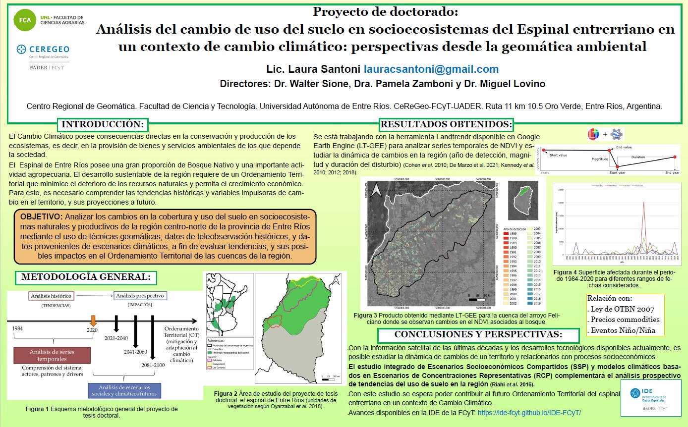

# 🌱 Análisis del cambio de uso del suelo en socioecosistemas del Espinal entrerriano en un contexto de cambio climático: perspectivas desde la geomática ambiental
---

**Autores:** Laura Santoni (CONICET), Walter Sione (UADER), Pamela Zamboni (UADER), Miguel Lovino (UNL)  
**Institución:** FCA-UNL, UADER, CONICET  
**Ubicación geográfica:** Espinal, Entre Ríos, Argentina  
**Año:** 2022–2024

---

## 📝 Resumen

El cambio climático afecta directa e indirectamente los ecosistemas. En el sudeste de Sudamérica, el aumento de la temperatura media, las precipitaciones y los eventos extremos provocan cambios en los usos del suelo y generan vulnerabilidad en los socioecosistemas. Este trabajo busca analizar los cambios en la cobertura y uso del suelo en el Espinal entrerriano, donde coexisten áreas de bosque nativo y actividades productivas, a fin de evaluar tendencias e impactos en el Ordenamiento Ambiental Territorial.

Se trabaja con técnicas geomáticas y relevamientos territoriales, series históricas de sensores remotos (LANDSAT y Sentinel), y modelos climáticos y sociales futuros (SSPs). El objetivo es estudiar conflictos y proponer estrategias para una gestión sustentable del territorio bajo escenarios presentes y futuros.

---

## 🛠️ Metodología

- **Período de análisis:** 1990–2020  
- **Datos:** LANDSAT, Sentinel, escenarios SSPs  
- **Técnicas:** detección de cambios, análisis espacial y multitemporal, segmentación espacio-temporal (LandTrendr), decisión multicriterio  
- **Objetivo:** evaluar la estructura, funcionalidad y cambios en el uso del suelo con relación a variables ambientales y socioeconómicas

---

## 🗺️ Presentación de avances y resultados

### 📍 Caso de estudio: cuenca del arroyo Feliciano (Entre Ríos)

**Título:** *Geotecnologías aplicadas al análisis espacio-temporal de la deforestación en la cuenca del arroyo Feliciano (Entre Ríos)*  
**Evento:** VI Congreso Internacional de Ordenamiento Territorial y Tecnologías de la Información Geográfica. Buenos Aires, 26–28 de Octubre de 2022

El algoritmo **LandTrendr** aplicado en GEE permitió identificar deforestaciones entre 1984 y 2020. Se detectaron pérdidas anuales entre 5 y 20.400 ha, con picos en 1987, 2008, 2009 y 2019. Las zonas más afectadas se localizaron en el sur de la cuenca, en correlación con el avance agropecuario.

🔗 [Descargar presentación](https://drive.google.com/file/d/1fK1M2k_7MewME4o5wmfchyVzSv1PsuLj/view?usp=sharing)

---

## 📢 Difusión y extensión

- **Jornada Provincial de Difusión de Proyectos de Tesis y Líneas de Investigación doctorales y postdoctorales**  
  *Concordia, 26 de Abril de 2023*

- **¿Qué hacemos los investigadores de CONICET de la FCyT – Oro Verde?**  
  *Presentación de líneas de investigación en Ciencias Biológicas, UADER – Oro Verde, 26 de Junio de 2024*

<iframe width="850" height="478" src="https://www.youtube.com/embed/W_4RKyJfWpo?si=_3jy-ZTQmjvFrsEx" title="YouTube video player" frameborder="0" allowfullscreen loading="lazy" referrerpolicy="strict-origin-when-cross-origin"></iframe>

- **Nueva mirada sobre el monte nativo hoy**  
  *Federal, 6 de Septiembre de 2024*

- **Encuentro de doctorandos: presentación de trabajos y resultados de investigación**  
  *Concepción del Uruguay, 27 de Septiembre de 2024*

---

## 🏷️ Metadatos

| Campo                  | Valor                                                                 |
|------------------------|-----------------------------------------------------------------------|
| **Tema**               | Cambio de uso del suelo, cambio climático, geomática, Espinal         |
| **Tipo de proyecto**   | Tesis doctoral                                                        |
| **Palabras clave**     | LandTrendr, SIG, NDVI, deforestación, sensores remotos                |
| **Formato de imagen**  | JPG, presentación (PDF)                                               |
| **Licencia**           | CC BY-SA 4.0                                                           |
