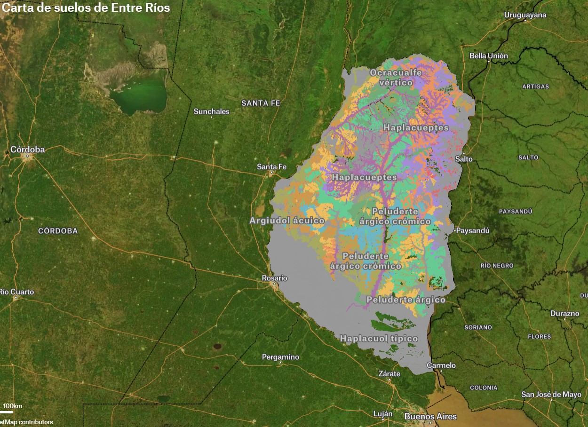

# Carta de suelos de Entre Rios
---

**Tipo de contenido:** Capa geoespacial provincial  
**Cobertura geografica:** Entre Rios, Argentina

---

## Vista previa

## Recursos asociados

- **Visor interactivo:** [Abrir mapa en Felt](https://felt.com/map/Carta-de-suelos-de-Entre-Rios-5whiguPwSsSzPVr58t9AG6C?lat=-32.119386&lon=-59.288105&zoom=7.39)
- **Descarga de capa:** [Descargar suelos_ER.zip](https://ide-suelo.s3.amazonaws.com/suelos_ER.zip)
- **Codigo fuente:** no aplica.

## Metadatos

| Campo | Valor |
|---|---|
| Tema | Suelos, cartografia tematica, gestion territorial |
| Tipo de proyecto | Publicacion de datos |
| Palabras clave | suelos, entre rios, mapa, capa SIG |
| Formatos | ZIP (SHP), web map |
| Licencia | Segun fuente de datos |
