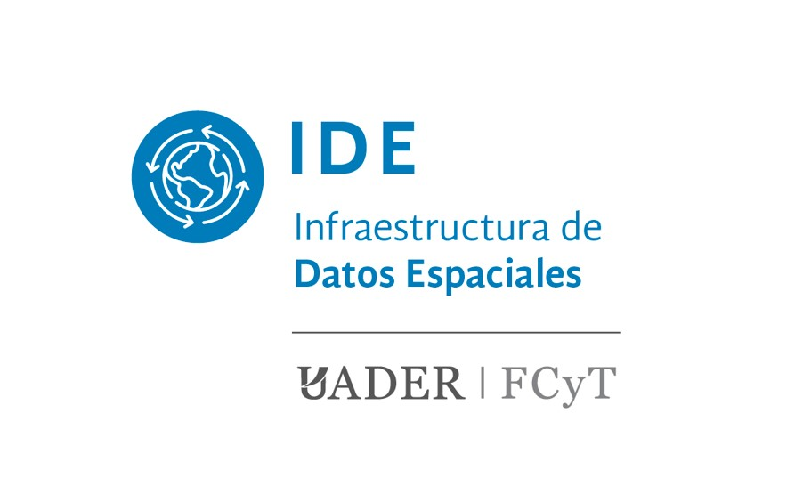

# Contacto institucional

## Infraestructura de Datos Espaciales - FCyT UADER

La Facultad de Ciencia y Tecnologia de la UADER es una institucion publica de educacion superior orientada a la formacion, investigacion y extension en ciencias, tecnologia y territorio.

## Mision institucional

La FCyT promueve la formacion de profesionales con compromiso social, pensamiento critico y capacidad de aportar a la educacion publica, la investigacion aplicada y el desarrollo regional.

## Estructura territorial

La Facultad desarrolla actividades academicas en distintas localidades de la provincia de Entre Rios, con sedes, extensiones aulicas y escuelas preuniversitarias.

## Ubicacion sede central (Oro Verde)

<iframe src="https://www.google.com/maps/embed?pb=!1m14!1m8!1m3!1d6779.327413434335!2d-60.521919!3d-31.83415!3m2!1i1024!2i768!4f13.1!3m3!1m2!1s0x95b44b973b15bedd%3A0xa59a2314fe8063f2!2sFacultad%20de%20Ciencia%20y%20Tecnolog%C3%ADa%20(UADER)!5e0!3m2!1ses-419!2sar!4v1749747662227!5m2!1ses-419!2sar" title="FCyT UADER Oro Verde" allowfullscreen loading="lazy"></iframe>

## Canales de contacto

- **Correo IDE:** fcyt_ide@uader.edu.ar
- **Sitio institucional FCyT:** [https://fcyt.uader.edu.ar/](https://fcyt.uader.edu.ar/)
- **Repositorio IDE-FCyT:** [https://github.com/IDE-FCyT/IDE-FCyT](https://github.com/IDE-FCyT/IDE-FCyT)
