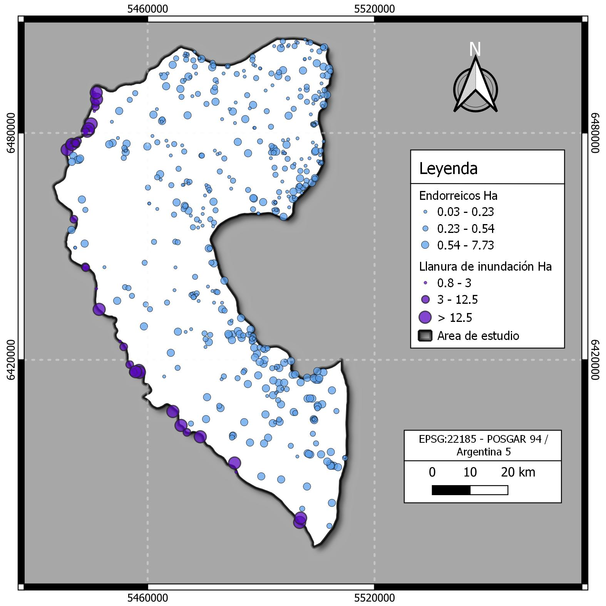

# 🐸 Inventario de Humedales en el centro-oeste de Entre Ríos: base para su protección y gestión sostenible
---

**Autores:** Boladeras Facundo, Battauz Yamila 
**Institución:** FCyT - UADER  
**Ubicación geográfica:** Centro-oeste de la provincia de Entre Ríos, Argentina  
**Año:** 2025

---

## 📝 Resumen

Los humedales son ecosistemas claves por su biodiversidad, funciones hidrológicas y servicios ecosistémicos. Sin embargo, están entre los más degradados del mundo. Frente a este escenario, los **inventarios de humedales** resultan herramientas esenciales para su protección y gestión sostenible, ya que permiten identificar, clasificar y monitorear estos cuerpos de agua.

Este trabajo propone una **metodología mixta** que combina técnicas de interpretación visual mediante imágenes satelitales (Google Earth), generación de datos raster con Google Earth Engine, y análisis hidrológico en QGIS para **cartografiar humedales** del sistema “Tributarios Cortos Entrerrianos del río Paraná”.

---

## 🌎 Área de estudio

El sistema se ubica en el centro-oeste de la provincia de Entre Ríos, e incluye parcialmente los departamentos Paraná, Diamante y Victoria. Abarca cuencas como:

- Arroyo Las Conchas (completamente contenida)
- Río Gualeguay (intersecta parcialmente)
- Arroyos menores como Dol y Ensenada (agrupados como aportes menores)

Estos cuerpos de agua drenan hacia el río Paraná, conformando una red de humedales lénticos y lóticos con alta variabilidad morfométrica.

---

## 📊 Resultados destacados

- Área total del estudio: **558.200 ha**  
- Total de cuerpos de agua identificados: **511**
- Promedios por cuenca:

| Cuenca                   | Cantidad | Área (ha) (media) | Perímetro (m) (media) |
|--------------------------|----------|-------------------|------------------------|
| Arroyo Las Conchas       | 249      | 0.5               | 322.7                  |
| Aportes menores Paraná   | 124      | 0.9               | 377.9                  |
| Río Gualeguay            | 36       | 1.4               | 555.6                  |
| Llanura de inundación    | 53       | 16.7              | 1767.1                 |

Las lagunas endorreicas fueron pequeñas y aisladas, mientras que las de la llanura de inundación fueron más extensas y morfológicamente complejas.

---
*Figura 1. Inventario de humedales.*

## 🐦 Importancia del inventario

- Proporciona una base cartográfica clave para gestión y conservación.
- Evidencia incompatibilidades entre la expansión agrícola y la protección de humedales.
- Sirve como insumo para políticas públicas, ordenamiento territorial y estrategias de restauración.

---

## 🏷️ Metadatos

| Campo                  | Valor                                                                          |
|------------------------|--------------------------------------------------------------------------------|
| **Tema**               | Inventario de humedales, cartografía, conservación, análisis espacial          |
| **Tipo de proyecto**   | Investigación aplicada / Producto cartográfico                                 |
| **Palabras clave**     | humedales, Entre Ríos, Earth Engine, SIG, Random Forest, cuencas, GEE          |
| **Formato de imagen**  | PNG / vectorial                                                       |
| **Licencia**           | CC BY-SA 4.0                                                                   |
