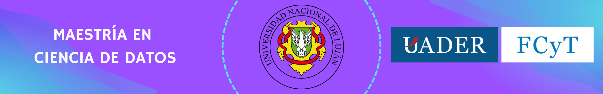
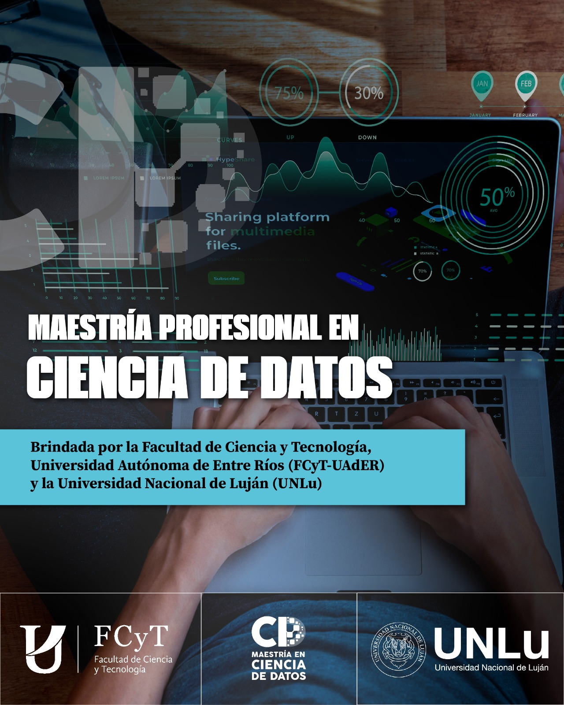

---
hide:
  - navigation
  - toc
---

 
## Presentación
La producción de datos de naturaleza diversa se ha acelerado notoriamente.  
El crecimiento de usuarios, servicios digitales, dispositivos conectados y recursos computacionales genera **grandes volúmenes de datos heterogéneos**.  

Esto plantea desafíos en toda la cadena:  
- Captura y almacenamiento  
- Organización e interpretación  
- Síntesis y transformación en valor  

La **Ciencia de Datos** surge de la combinación de **computación, estadística y matemática**, con el objetivo de:  
- Interpretar y analizar datos  
- Generar modelos predictivos  
- Mejorar la toma de decisiones en distintos ámbitos organizacionales
---
## Características de la Maestría
- **Tipo:** Maestría Profesional Interinstitucional  
- **Modalidad:** Semi-presencial, semiestructurada  
- **Duración:** 4 semestres  
- **Carga horaria total:** 776 horas  
  - 576 h en seminarios y talleres  
  - 200 h dedicadas a la tesis  
---
## Instituciones Responsables
- **Universidad Nacional de Luján (UNLu)** – Sede Luján  
- **Universidad Autónoma de Entre Ríos (UADER)** – FCyT, Sede Oro Verde  

**Resoluciones de aprobación:**  
- Res. CS UAdER 1487/23  
- RESHCS-LUJ 0000789-23  
- Dictamen CONEAU Acta 621/Nov. 2024  

**Dirección Interinstitucional:**  
- Dr. Walter F. Sione  
---
## Plan de Estudios
Organizado en dos ciclos:
### Ciclo Básico
Desarrolla fundamentos de ciencia de datos y herramientas elementales.
### Ciclo Superior
Orienta al desarrollo de capacidades avanzadas en ciencia de datos.

---
## Seminarios y Talleres
1. Técnicas de Análisis para Ciencia de Datos  
2. Fundamentos de Ciencia de Datos  
3. Aprendizaje Automático  
4. Visualización de la Información  
5. Ciencia de Datos aplicada I  
6. Ciencia de Datos aplicada II  
7. Aspectos Legales y Éticos del Uso de la Información  
8. Taller de Formulación de Tesis  
---
## Requisitos de Admisión
Dirigido a personas con título de grado (mínimo 4 años) en áreas relacionadas con:  
- Computación  
- Matemáticas  
- Estadística  
- Física  
- Ingeniería  
- Ciencias de la Tierra  
- Biología  
- Ciencias Forenses y de la Seguridad  
- Salud  
- Economía  
---
## Arancel
El costo consiste en un **arancel mensual durante 24 meses**, cuyo monto será definido por la Comisión Académica de la Carrera.

---

