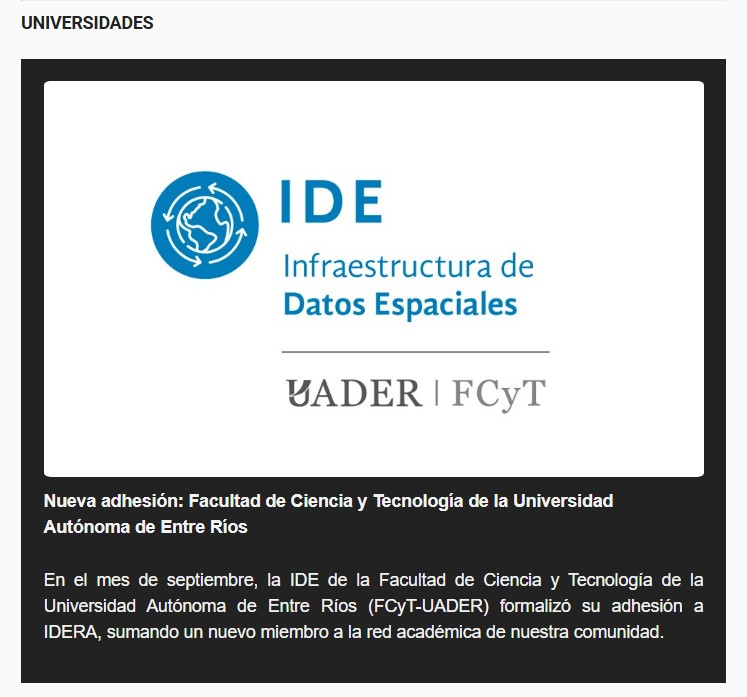
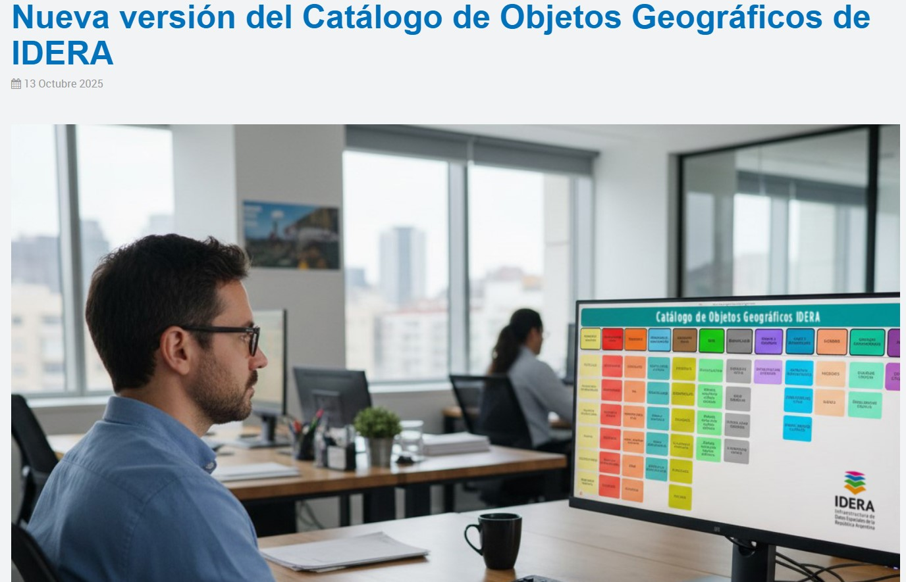

# Novedades
# Novedades

-   

    ### Adhesión de la IDE-FCyT a IDERA  
    **Fecha:** 10 de octubre de 2025

    En septiembre, la Infraestructura de Datos Espaciales de la Facultad de Ciencia y Tecnología de la UADER formalizó su adhesión a IDERA, sumando un nuevo miembro a la red académica nacional.

    [Leer más →](https://mailchi.mp/9cbd10081684/boletn-informativo-ideractiva-mes-10)

-   

    ### Nueva versión del Catálogo de Objetos Geográficos de IDERA  
    **Fecha:** 13 de octubre de 2025

    Ya está disponible la nueva versión del Catálogo de Objetos Geográficos (COG) de IDERA, desarrollada por el GTT “Información Geoespacial”.

    **Principales novedades:**
    - 12 clases, 58 subclases, 287 objetos geográficos y 262 atributos.  
    - Nuevos objetos geográficos y mejoras visuales para la navegación.  
    - Actualización de Datos Básicos y Fundamentales, con ampliaciones y cambios de nombre.

    El catálogo organiza objetos, atributos y relaciones, favoreciendo la estandarización e interoperabilidad en Argentina.

    [Leer más →](https://www.idera.gob.ar/index.php/publicaciones/noticias/nueva-version-del-catalogo-de-objetos-geograficos-de-idera)

> Última actualización: octubre 2025
