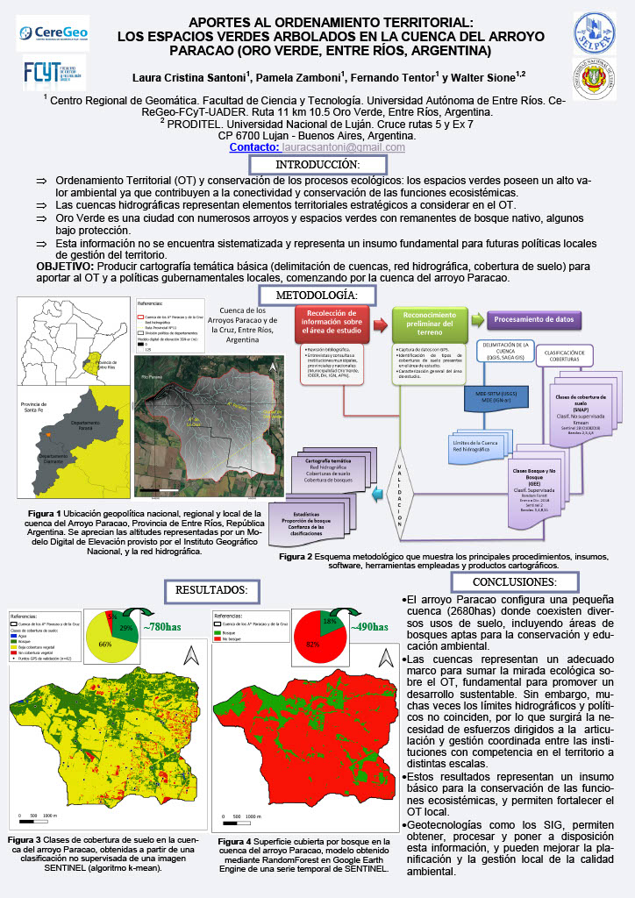

# 🏞️ Contexto territorial de la cuenca del arroyo Paracao desde una perspectiva de conservación ecosistémica y gestión estratégica de los recursos naturales
---

**Autores:** Laura Santoni, Pamela Zamboni  
**Institución:** FCyT - UADER  
**Ubicación geográfica:** Cuenca del arroyo Paracao, Oro Verde, Entre Ríos, Argentina  
**Año:** 2017–2018

---

## 📝 Resumen

Las cuencas hidrográficas son unidades clave para el **Ordenamiento Territorial (OT)**. En ellas, los bosques nativos juegan un papel central en la conservación de funciones ecosistémicas. Este trabajo estudia la **cuenca del arroyo Paracao** (2680 ha), ubicada en la ciudad de Oro Verde, Entre Ríos.

Se utilizó un **Modelo Digital de Elevación (MDE)** para la delimitación de la cuenca y se aplicaron dos técnicas de clasificación sobre imágenes Sentinel-2 (año 2018):

- **Clasificación no supervisada:**  
  - Bosques: 29%  
  - Vegetación herbácea: 66%  
  - Sin cobertura vegetal: 5%  
  - Precisión: 71%

- **Clasificación supervisada en Google Earth Engine:**  
  - Bosques: 18%  
  - Sin bosque: 82%  
  - Precisión: 98%

Los bosques nativos se ubican principalmente en el oeste de la cuenca, en zonas menos urbanizadas y cercanas al río Paraná. Se obtuvo **cartografía temática** de valor para la gestión ambiental y la planificación local.

---

## 🎓 Presentaciones a congresos

**Evento:**  
*XII Jornadas de Educación en Percepción Remota en el Ámbito del MERCOSUR*  
*Título:* *Geotecnologías y educación: nuevos paradigmas para la gestión de un planeta cambiante*  
*Lugar y fecha:* Buenos Aires, 11 al 15 de Noviembre de 2017

📎 [Descargar artículo](https://drive.google.com/file/d/1uLjlWpnqLyuavL0-w7j1CcYb1sg4ik2f/view?usp=sharing)  
📎 [Descargar tesis](https://bibliotecavirtual.unl.edu.ar:8443/handle/11185/8541)

---

## 🏷️ Metadatos

| Campo                  | Valor                                                                 |
|------------------------|-----------------------------------------------------------------------|
| **Tema**               | Cuencas hidrográficas, ordenamiento territorial, clasificación de cobertura |
| **Tipo de proyecto**   | Trabajo de investigación / Cartografía temática                       |
| **Palabras clave**     | Paracao, Sentinel-2, bosque nativo, clasificación, GEE                |
| **Formato de imagen**  | JPG, PDF                                                              |
| **Licencia**           | CC BY-SA 4.0                                                           |
