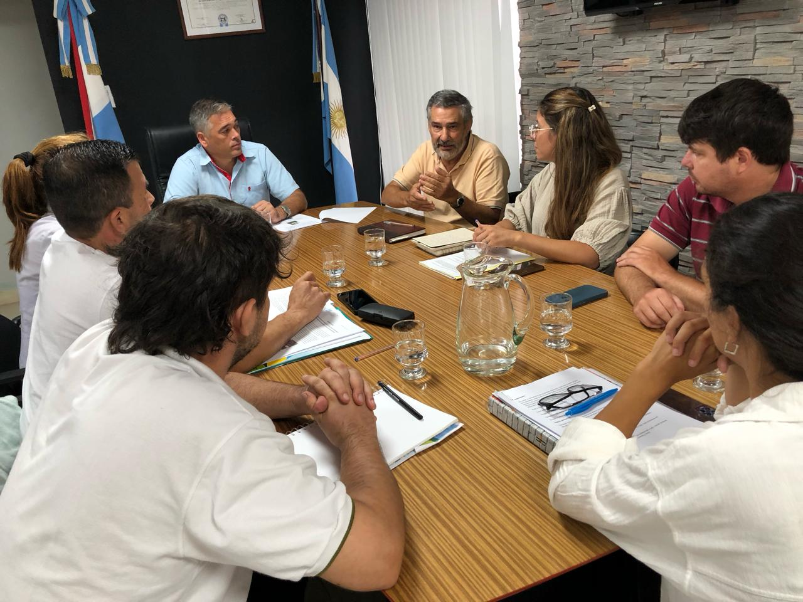

# 🌳 Asesoramiento al Municipio de San Benito (Entre Ríos) para la planificación de espacios verdes y arbolado urbano
---

**Autores:** Lic. Prof. Alfredo Grimaux, Prof. Cristian Hergenreder, Lic. Laura Santoni, Ing. Agr. Roberto Pereyra  
**Colaboran:** Dra. Sabrina Rodríguez, Dra. Pamela Zamboni, Dr. Pablo Aceñolaza, Dra. Estela Rodríguez, Agustín Godoy  
**Institución:** FCyT - UADER  
**Ubicación geográfica:** San Benito, Entre Ríos, Argentina  
**Año:** 2023–2024

---

## 📝 Resumen

La Facultad de Ciencia y Tecnología (FCyT-UADER) promovió un convenio de colaboración con el Municipio de San Benito (ER), enfocado en la planificación de espacios verdes, arbolado urbano y estrategias de restauración ecológica urbana.

Durante cuatro meses (noviembre 2023 – febrero 2024), el equipo llevó adelante actividades como:

- Reuniones de planificación
- Relevamientos de vegetación urbana
- Uso de drones y SIG para modelado territorial
- Diseño de infraestructura verde y propuesta de viveros de plantas nativas
- Jornadas de socialización con comunidad y autoridades

El trabajo incorporó conceptos de **infraestructura verde** e integración de servicios ecosistémicos en la planificación local, articulando la producción académica con las necesidades del territorio.

San Benito, con cerca de 30.000 habitantes, posee gran potencial de crecimiento urbano. Este proceso acompañó a la Municipalidad en el diseño de políticas ambientales con enfoque sostenible.

---

## 🗺️ Mapa integrador

---

## 🎥 Material audiovisual

<iframe width="850" height="478" src="https://www.youtube.com/embed/HTwwgo9o7Ms?si=k-LniCu_RZtJb2NM" title="YouTube video player" frameborder="0" allowfullscreen loading="lazy" referrerpolicy="strict-origin-when-cross-origin"></iframe>

---

## 📄 Informes técnicos

- 📎 [Primer informe de avance](https://drive.google.com/file/d/1y3725rnHsFMU7OGkOKZJDfpdd4xXQCEk/view?usp=sharing)  
- 📎 [Segundo informe de avance](https://drive.google.com/file/d/1wQWLqXIege40xjVfKpua5MNfwlTJ6u__/view?usp=sharing)  
- 📎 [Informe final del proyecto](https://drive.google.com/file/d/1LVn_1HueopL33H2xEtibUyWUc0Laf-M5/view?usp=sharing)

---

## 🖼️ Galería

---

## 🏷️ Metadatos

| Campo                  | Valor                                                                 |
|------------------------|-----------------------------------------------------------------------|
| **Tema**               | Arbolado urbano, espacios verdes, planificación territorial           |
| **Tipo de proyecto**   | Convenio de colaboración / Extensión / Asesoramiento técnico          |
| **Palabras clave**     | Infraestructura verde, SIG, vegetación urbana, plantas nativas        |
| **Formato de imagen**  | JPG, PDF, video                                                       |
| **Licencia**           | CC BY-SA 4.0                                                           |
