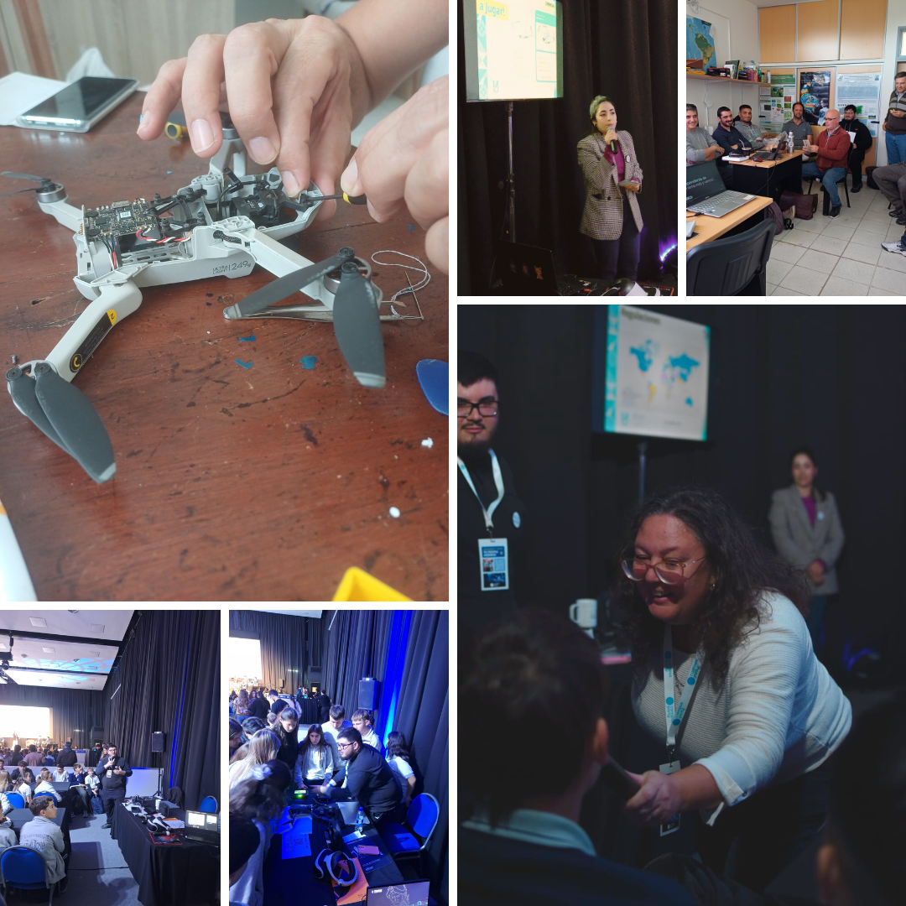

# 🌍 Experiencias en el uso y aplicaciones de los Vehiculos Aéreos No Tripulados- VANT -Drones
---

**Autores:** Pamela Zamboni, Virginia Piani y Alan Evequoz   
**Institución:** FCyT - UADER - CereGeo

## 📝 Resumen

Los Vehículos Aéreos no Tripulados (VANT), comúnmente denominados "Drones" y los Sistemas de VANT, son aeronaves que vuelan sin tripulación, la cual ejerce su función remotamente.  Si bien sus usos son muy variados, muchos de ellos tienen una gran utilidad para diferentes aplicaciones vinculadas a la gestión del territorio. En Argentina su regulación está a cargo de la Administración Nacional de Aviación Civil, ANAC. Desde el CereGeo ofrecemos actividades de capacitación, vuelos y servicios de modelado, relevamientos, entre otras.

## 1. Capacitaciones y Difusión

Desde el Centro Regional de Geomática (CeReGeo) se desarrollan instancias de formación y divulgación orientadas a la aplicación de nuevas tecnologías. En este marco, se han dictado los siguientes talleres:

* Introducción al conocimiento de las aplicaciones de los Vehículos Aéreos No Tripulados (VANT) para la gestión del territorio.

* Introducción al conocimiento de las aplicaciones de los Vehículos Aéreos No Tripulados (VANT) y su utilidad para el control y vigilancia de sistemas productivos.

* Pilotos del futuro – Taller de drones para jóvenes curiosos.

Para acceder al material de las capacitaciones, puede ingresar en el siguiente enlace:

- 📎 [Acceder a la carpeta de capacitaciones](https://drive.google.com/drive/folders/14rAmwXDzBfRYiK6vXb-ZOamzEnRs4E7y?usp=drive_link) 

## 2. Vuelos

<iframe width="850" height="478" src="https://www.youtube.com/embed/X8hf1ia644M?si=yREEOvb4OYd7Batt" title="YouTube video player" frameborder="0" allow="accelerometer; autoplay; clipboard-write; encrypted-media; gyroscope; picture-in-picture; web-share" referrerpolicy="strict-origin-when-cross-origin" allowfullscreen></iframe>

## 3. Fotos de las actividades

