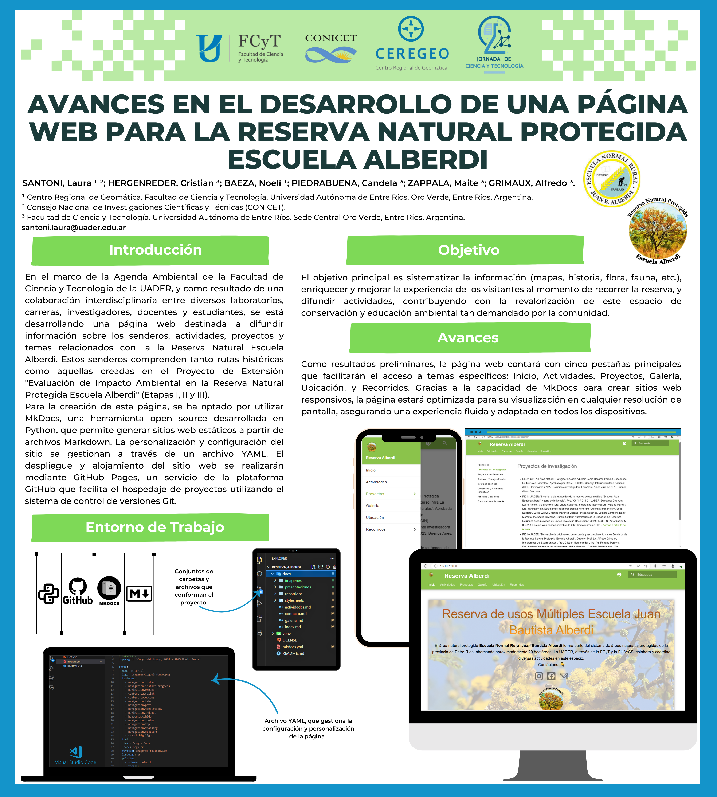

# Avances en el desarrollo de una pagina web para la Reserva Escuela Alberdi
---

**Autores:** Laura Santoni, Cristian Hergenreder, Noeli Baeza, Candela Piedrabuena, Maite Zappala, Alfredo Grimaux  
**Institucion:** FCyT - UADER  
**Ubicacion geografica:** Reserva Natural Protegida Escuela Alberdi, Entre Rios  
**Periodo:** 2024-2025

---

## Resumen

Este trabajo presenta el desarrollo de una pagina web para sistematizar informacion de la Reserva Escuela Alberdi, incluyendo senderos, historia, biodiversidad y actividades de extension.

La iniciativa articula laboratorios, carreras, docentes, investigadores y estudiantes de la FCyT-UADER. El objetivo es mejorar la experiencia de visitantes, fortalecer la divulgacion ambiental y consolidar un canal publico de acceso a contenidos territoriales.

## Resultados alcanzados

- Estructuracion de contenidos de la reserva en formato web.
- Integracion de recursos de mapa, imagenes y material textual.
- Implementacion basada en software libre y publicacion en infraestructura GitHub.

## Recursos asociados

- **Visor interactivo:** en desarrollo.
- **Descargas:** se publican segun disponibilidad institucional.
- **Codigo fuente:** metodologia basada en MkDocs y GitHub Pages.

## Metadatos

| Campo | Valor |
|---|---|
| Tema | Divulgacion ambiental, comunicacion cientifica, web geoespacial |
| Tipo de proyecto | Desarrollo web institucional |
| Palabras clave | reserva alberdi, mkdocs, divulgacion, acceso publico |
| Formatos | PNG, contenido web |
| Licencia | CC BY-SA 4.0 |
